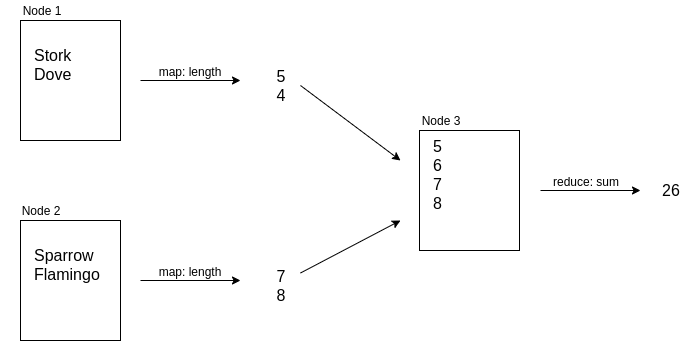

# A Bird Tracking Example Application
Our goal is to go over the basics of the *MapReduce*. This execution pattern was developed at Google in the early 2000s and has been inspired by the `map` and `reduce` operations common in functional programming.

In the following, we'll approach the pattern by observing how it operates on data. More precisely, on test data from a tiny example application. We'll use Unix pipelines for the first steps, then switch to Python to go through some more elaborate use cases. But first, let's take a look at the application and create ourselves some fake data.

```markdown
# Prerequisites

python >= 3.6
```


## I've Just Seen a Sparrow in Italy
Through our little application users can notify us when they have encountered a bird. In particular, they can tell us which species they've encountered and where. Let's assume that for some reason the app is really popular and we have collected many such observations from millions of users throughout the world.

To learn more about our natural environment, we collect all the data and store it in a large csv file to run some analyses. With one observation, a `bird species` and a `country code`, per line, on without collecting any futher information for now, our data will look something like this:

```txt
Stork,LY
Hawk,IL
Goose,LY
Goose,LY
Turkey,EE
Bald eagle,BD
```

As you can see, our list is not sorted in any way, and birds and country codes can appear multiple times, and even the same bird-country combination can appear multiple times.


## Command Line Statistics on Test Data
To get started, we generate some fake data. For now, we'll use the current working directory to do some experiments, but we'll create a subdirectory for our data to stay organized. As for test data, a random combination of a bunch of birdnames and country codes should suffice for now. Use the data generator in [birds.py](scripts/birds.py) to create a set of test data:

```sh
# a place to keep our data
mkdir ./data

# generate 50 fake observation in two files
python scripts/birds.py -n 20 > data/birds1.csv
python scripts/birds.py -n 30 > data/birds2.csv

# inspect the data
cat data/birds*.csv | head -n 5
```

At this point, we have simulated user activity and collected data into multiple files. These files stand for a large dataset that is split into multiple parts and distributed across multiple machines, as will likely be the case once we start using Hadoop. But for now, it's all on our local filesystem and we can start asking some questions. The Unix command line can become a powerful analysis tool in this context.

```sh
# how many observations do we have in total?
cat data/birds*.csv | wc -l

# how many unique birds are there?
cat data/birds*.csv | sort | cut -d , -f 1 | uniq | wc -l

# what are the top five most observed birds?
cat data/birds*.csv \
  | sort \
  | cut -d , -f 1 \
  | uniq -c \
  | sort -t ' ' -k1,1 -nr \
  | head -n 5
```

Using the command line, we can create powerful streaming pipelines that can help us answer simple questions. However, more elaborate questions may require a lot of effort to answer in this manner. Take, for instance, the question: how many different species are observed in each country on average? We'd need to group birds by country, then create a sum of unique birds in each group and finally average over all these sums. And what if our data is stored on multiple computers? Would we transfer it across the network to put it through our pipeline? This would become even more problematic if we wanted to handle massive amounts of data that could not possibly fit onto a single computer. That's where *MapReduce* enters the stage.


## Programming with Mappers and Reducers
Two common concepts from *functional programming* are `map` and `reduce`, and they are often used together. Both operate on collections of data. A *mapping* replaces each item in the collection with another one, namely with the result of passing the item through some function. A *reduction* compresses or combines all values into an aggregate value.

As an example, assume we have a list of bird names and want to count the *total number of characters* used in this list. One way to do this would be to loop through all the names and add the respective length to a running total:

```py
""" counting characters using a loop """

birds = ['Stork', 'Dove', 'Sparrow', 'Flamingo']

# initialize a running total
total = 0

# add the number of character in each name
for name in birds:
    total = len(name)
```

Notice how this is already an example of a `reduce` operation: we have compressed the list of names into a single number.

In this example, we have counted the number of characters *while* iterating over the names. An alternative approach would be to first count the characters in each word, and then, in a second step, sum up all the counts.

```py
""" Counting characters in two steps """

birds = ['Stork', 'Dove', 'Sparrow', 'Flamingo']

# 1. map
word_lengths = [len(name) for name in names]

# 2. reduce
total = sum(word_lengths)
```

We can see how a *map* and *reduce* step work together to achieve the desired result. This seemingly simple pattern can be very powerful. As Jeffrey Dean and Sanjay Ghemawat write in their [seminal paper](https://research.google/pubs/pub62/) accompanying their implementation of *MapReduce* at Google:

> We realized that most of our computations involved applying a *map* operation to every logical "record" in our input in order to compute a set of intermediate key/value pairs, and then applying a *reduce* operation to all the values that shared the same key, in order to combine the derived data appropriately.

In our examples, we have not encountered any key/value pairs because counting characters was such a simple exercise that we got away without them. But already in the previous section, when we were counting birds by species, we needed to add up all the birds in one species, so we were - at least implicitly - already using the species as group keys.

The formalization using key/value pairs as well as the application of reducers to intermediate results with identical keys is where Google's *MapReduce* pattern goes beyond the *mappers* and *reducers* we know from functional programming.

In the next section, we will take a look at the whole framework and try to answer our open question from before that was too complicated for a simple Unix pipeline. Before that, however, let us briefly reflect on how this pattern might lend itself to parallel execution.

  

*Figure 1: Distributed Map Reduce Process. Multiple nodes perform a mapping operation in parallel. Only the results need to travel across the network to be aggregated in the final reduce step.*

The map operation is a transformation of one piece of information into another. It is fully determined by the transformation function and does not need to know anything about the rest of the data. Because of this independence, a data set can be split into multiple pieces and the mapping can be performed on each of them in parallel on multiple machines. After the map step, the intermediate results (the character counts), could be collected to be summed up, as figure 1 illustrates.

If we assume for a moment that counting the length of words was a very time consuming operation, we see how the above job could get a performance increase if many computers were working on it in parallel. Actually, even just reading a massive data set from dist can take a *lot* of time, and parallel reading speeds up this process linearly with each additional cluster node: two computers, each reading half of the data set in parallel, takes only half the time.


## Counting Birds with MapReduce
How many different species can we expect to live in a single country? In other words: how many different species live in each country on average? That's a more elaborate question now. Let's see how we can answer it using *MapReduce*. This way of solving problems may take a little getting used to, but that's fine because we're not in hurry. Or are we?

First, we probably want to group the birds by country and then in a second step count how many unique species are in each group before computing the average count over all groups. To group birds by country, we can go over all observations and for each one output first the country, then the bird. Once we sort this output, we can see how groups start to form.

To illustrate this approach, let's start with some **raw observation data**:

```txt
Stork,LY
Hawk,IL
Goose,LY
Goose,LY
Duck, IL
Bald eagle,BD
```

This is turned into a list of key/value pairs (using the `<key><TAB><value>` format) with the **country listed first**:

```txt
LY      Stork
IL      Hawk
LY      Goose
LY      Goose
IL      Duck
BD      Bald eagle
```

This can be seen as a mapping where the mapper has turned each record into a single key/value pair. Now let's **sort** this list. We can see how birds in the same group are listed together:

```txt
BD      Bald eagle
IL      Duck
IL      Hawk
LY      Goose
LY      Goose
LY      Stork
```

At this point, we can **count unique birds** per country conveniently:

```txt
BD      1
IL      2
LY      2
```

This last step is a reduce operaton that has condensed the input by computing aggregates for each group. Notice that the reducer output is not a single value, but is once more a list of key/value pairs. This need not be the case, but it is definitely possible and not uncommon. In fact, many real world *MapReduce* jobs stack multiple mappers and reducers on top of each other.

We're not done yet. We wanted to compute the average number of different species per country, and so far we only have the species count per country. What's left is to compute the average over these counts. That's clearly a job for a reducer - it's input will be the list of counts, and this time it produces a single number, the average, as output. We can chain this reducer onto the previous one. Alternatively, the previous reducer could already have computed the average itself, but this way we have an opportunity to see chaining in action.

To summarize, we have seen how three distinct tasks combine to form a single *MapReduce* step: `map`, `sort` and `reduce`. Be aware that sorting is an integral part of the approach. We have also seen how all of these tasks can operate on key/value pairs and can have key/value pairs as output. And finally, multiple *MapReduce* steps can be chained together. That's *MapReduce* in a nutshell.


## Implementing MapReduce
After the conceptual clarifications, it's time to try *MapReduce* in practice. The code for the previously described map and reduce steps can be found in [mapper.py](scripts/mapper.py), [reducer-count.py](scripts/reducer-count.py) and [reducer-mean.py](scripts/reducer-mean.py), but we will go over everything here.

As noted in the opening paragraph, all code is written in Python. And what's more, to integrate the scripts with the rest of our previously build Unix pipelines, we will use STDIN and STOUT for communication.

Let's take a look at the mapper. All it has to do is output the country as key and the bird as value:

```py
""" mapper.py

Create country/bird pairs:
bird,country -> country<TAB>bird
"""

import sys

# read records line by line from STDIN
for line in sys.stdin.readlines():
    # observations are comma separated, so we split each line
    bird, country = line.rstrip('\n').split(',', 1)

    # output key/value pairs using <TAB> for demarkation
    print(f'{country}\t{bird}')
```

The mapper script does not seem to do much, but don't be fooled. It not only outputs the country as key to preprare for grouping by country. It would also get rid of any observation information we don't need. What if we didn't just store the bird and country for each observation, but also time and geolocation information, information about the user who submitted the information, perhaps an image of the observed bird, and so on. The output of our mapper script would still be only country/bird pairs, because that's all we care about for now. In a distributed setting, where this kind of information would need to travel across a network to other nodes in a cluster, getting rid of any unnecessary information is crucial for performance.

Next up is our first reducer, which counts distinct species in a country. It works by collecting all birds for one country in a set, which makes sure they are distinct. Once a new country appears, it outputs how many different birds were observed in the previous one, and creates a new set.

```py
""" reducer-count.py

Determine number of distinct birds per country
country<TAB>bird -> country<TAB>count
"""

import sys

# create a buffer to keep track of birds
previous_country = None
birds = set()

# read country/bird pairs from STDIN
for line in sys.stdin.readlines():
    country, bird = line.strip().split('\t')

    # when a new country appears, output the previous
    # country information and reset the buffer
    if country != previous_country:
        if previous_country is not None:
            print(f'{country}\t{len(birds)}')

        previous_country = country
        birds = set([bird])
    else:
        birds.add(bird)

# output information for the last country
print(f'{country}\t{len(birds)}')
```

Notice how this function only works if the input is sorted by country. Once a new country shows up, we assume we are finished with the previous one, output all information, and reset our buffer.

There are many ways to implement functionality like this, why did we chose a way that depends on the input being sorted? Isn't that unnecessary overhead - sorting can be a very expensive operation, especially with distributed data.

Remember that we are preparing to deal with massive amounts of data. With our example application, we will never have more than about 250 different countries in our dataset and there won't be a million different species of bird. But assume for a moment this did happen. Our reducer would then have to go through *all* the data, preparing counts for *all* countries and *all* species before starting to produce output. That can become problematic for two reasons:

1. Data volume might just be too big to keep everything in memory.
2. We can only start producing output when all data has been processed.

When the reducer can assume input is sorted by key, i.e. by country, it can handle one country at a time, then output the result. This is great for building streaming pipelines and for dealing even with huge amounts of data. What's more, sorting will allow us to distribute data to multiple reducers in parallel. As we will see later, Hadoop guarantees that key/value pairs with the same key will all be handled by the same reducer. But that's for later. For now, let's notice once again how the `sort` step is truly a central ingredient of *MapReduce*.

With this, we turn to our second and last reducer, which computes the average over all country counts:

```python
""" mapper.py

Compute average count over all counties
country<TAB>count -> average_count
"""

import sys

counts = [int(line.split('\t')[1]) for line in sys.stdin.readlines()]
print(sum(counts) / len(counts))
```

This reducer producer a single number, our final output. With this in place, we are ready to try out the whole pipeline on our example data. Make sure all scripts are executable (consider a `sudo chmod 755 *.py` in the working directory if you're unsure). If permissions on the scripts allow for execution, we can build the pipeline to answer the original question:

```sh
# biodiversity: average species per country
cat data/birds*.csv \
  | scripts/mapper.py \
  | sort \
  | scripts/reducer-count.py \
  | scripts/reducer-mean.py
```

We are piping our example data through the mapper, then sort and reduce, then chain the second reducer directly to the output of the first. As was mentioned before, in many analytics scenarios, more complex questions are answered by building long chains and even trees of map and reduce steps that build upon one another.


## Summary and Outlook

We've covered a lot of ground. From reviewing Unix pipelines for analytics processing, we went on to discussing the basics of *MapReduce* and have seen that there is a `sort` step in between that must not be overlooked. Finally, we have gone through an implementation of a *MapReduce* job in Python, all on test data from our bird tracking application.

These are only the basics of the *MapReduce* framework. What do we do if data is unbalanced and overloads a single reducer? Should it be persisted between different stages in a chained job? And how can we practically perform more complex operations such as SQL-like joins on massive, distributed datasets?

These are all valid, yet more advanced questions. For now, we have achieved what we set out to do: get a basic understanding of *MapReduce* and create some test data for an example application. We can not turn back to Hadoop and see how we can run our analytics jobs there.
